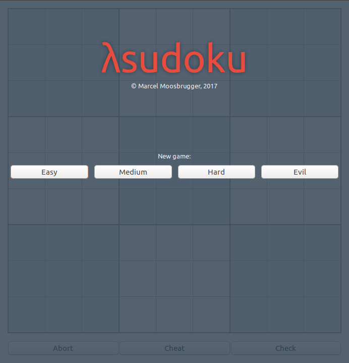
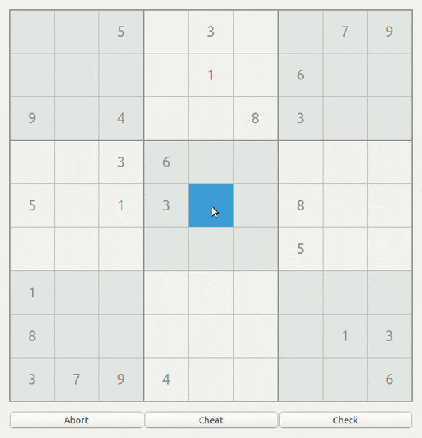

# λsudoku

[](https://travis-ci.org/marcelmoosbrugger/hsudoku)
[](https://github.com/marcelmoosbrugger/hsudoku/stargazers)
[](https://github.com/marcelmoosbrugger/hsudoku/issues)

[](https://raw.githubusercontent.com/marcelmoosbrugger/hsudoku/master/LICENSE)

-------
<p align="center">
    <a href="#appearance">Appearance</a> &bull;
    <a href="#motivation">Motivation</a> &bull;
    <a href="#installation">Installation</a> &bull;
    <a href="#installation">Usage</a>
    <a href="#tests and coverage">Tests</a>
    <a href="#documentation">Documentation</a>
</p>
-------

## Appearance

<h3 align="center">
  
  
</h3>

## Motivation

## Installation

## Usage
If everything is installed the game can be run from the installation folder:
```
dist/build/hsudoku/hsudoku
```

## Tests and Coverage
Tests can easily be run with:
```
cabal test
```

## Documentation
Documentation of the code and the hackage package can be found on [hackage/sudoku](https://hackage.haskell.org/package/hsudoku)

## Licence
This project is licensed under the terms of the MIT license. See the LICENSE file.
